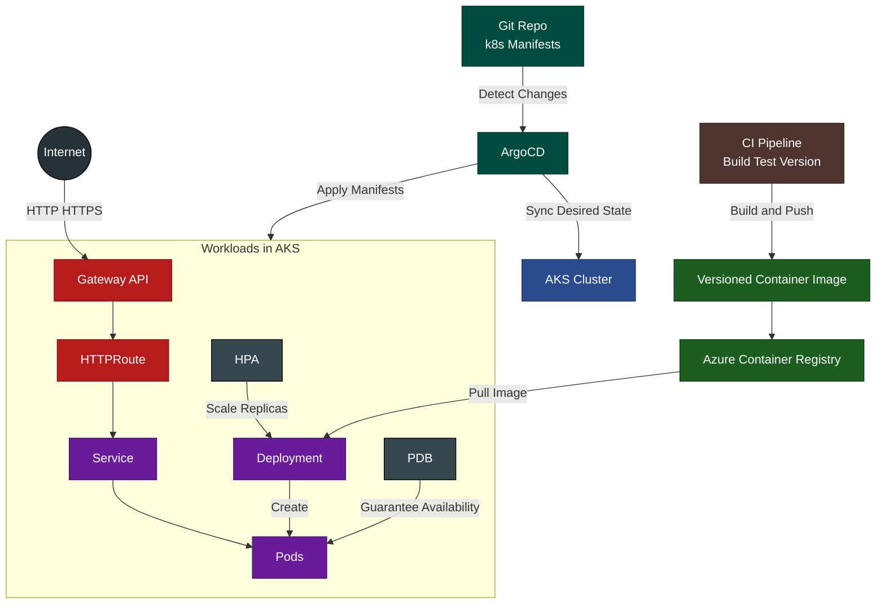

# WellArchitectedLab.MonoRepo

> **TLDR**
>
> This mono-repo is a full, working microservices cloud platform reference: it includes application source code, Infrastructure-as-Code to provision cloud resources (AKS, ACR, networking, RBAC), Kubernetes manifests and overlays, local development scaffolding, plus CI/CD pipelines and developer tooling. The goal is to show a realistic end-to-end developer + DevOps experience: from local dev to CI, tests, container images, cluster deployment and GitOps-based delivery (Argo CD).

---

## Table of contents

- Introduction
- Repository layout
  - `.github/` (github actions workflows & PR templates)
  - `iac/` (Infrastructure as Code with Terraform)
  - `k8s/` (Kubernetes manifests, overlays & AKS setup)
  - `src/` (application source, tests, docker-compose)
  - `setup/` (repository setup for contributors and generalistic dev experience scripts)
- Running the solution locally
- Developer & DevOps notes
- Contributing
- License

---

# Introduction

This mono-repo demonstrates a production-minded, full-stack microservices reference platform. It was assembled to teach and prove the complete delivery lifecycle: local development, automated testing, containerization, infrastructure provisioning (IaC), Kubernetes cluster management (AKS), CI using GitHub Actions, and continuous delivery using GitOps (Argo CD). The repo is intentionally opinionated.

Key intentions:
- Keep a single repository containing all technologies needed to build, test, package and deploy a sample weather forecast app.
- Provide IaC templates so the platform can be provisioned in Azure (AKS, ACR, networking, RGs, etc.).
- Illustrate a modern GitHub Actions-based CI and GitOps with Argo CD for delivery.
- Implement an enterprise grade shitft-left workflows for securely packaging, testing and deploying docker images into AKS clusters.

---
# Technical architecture

The following diagram models the intended technical architecture.

- All workloads are hosted in Azure Kubernetes Services.
- Manifests are added in k8s folder in this same repo and are watched by ArgoCd for instant sync.
- AKS exposes the workloads using a frontend and a backend Gateway API + Http Routes.
- Images are built by specific CI tools that integrate with github actions, under .github/workflows folder.

# Repository layout

## `.github/`

Contains repository-level GitHub configuration. Two important sub-areas to call out:

### `.github/workflows/`

All GitHub Actions workflows live here. They automate builds, tests, releases and other repo-level automation. See the folder for the exact YAML workflows. Examples of responsibilities these workflows typically cover:

- **Build & Test**: compile projects, run unit tests and publish test results.
- **Static Analysis**: run static checks for code quality using CodeCov.
- **Publish Artifacts**: build container images and push to the configured container registry (ACR) or publish packages.
- **Release & Tagging**: create Git tags/releases and optionally trigger GitOps pipelines.
- **CI Helpers**: maintenance tasks such as branch housekeeping or dependency updates.

(You can review the actual workflow files here.)

> Workflow folder: `/.github/workflows/` — **see**: https://github.com/WellArchitectedLabs/WellArchitectedLab.MonoRepo/tree/develop/.github/workflows. 

### `.github/PULL_REQUEST_TEMPLATE/`

Contains PR templates used to standardize contribution details, checklist and required information for reviewers. This helps maintain quality and ensures important information (testing, migration steps, security considerations) is included in each PR. The Pull Request Templates are used by git pr alias that you can install via installation script placed under scripts/git folder — see: https://github.com/WellArchitectedLabs/WellArchitectedLab.MonoRepo/tree/develop/scripts/git/aliases.

### Pull Request workflows:
As for an enterprise scale platform, the pull request validation validation is gated by status checks.

Status check workflow files are prefixed by pull-request:
- `pull-requests_checklist-enforcer.yml`: Enforces pull creator clicked on all PR template checkboxes.
- `pull-requests-wf-auto-assign.yml`: Auto assigns responsable teams to PRs based on the modified code. Very useful for mono repo setups. Teams are added on github organization level. In our case a parent team named wf-team is added with two child teams: wf-backend-team and wf-frontend-team. A deveops-team is also created in the same hierarchy as wf-team.
- `pull-requests_wf-codeql-analysis.yml`: Runs CodeQL, github's security check tool.
- `pull-requests_wf-auto-label.yml`: Add label to pull requests based on the changed file. Typically the weather forecast api pull requests will be labeled as backend and weather-forecast. Labels are very useful for PR grouping and filtering.
- `pull-request_weather-forecast-api-status-check.yml`: Runs a dry-run for weather forecast backend API CI workflow are is later launched on develop / main pushes.
- `pull-request_weather-forecast-frontend-status-check.yml`: Runs a dry-run for weather forecast frontend CI workflow are is later launched on develop / main pushes.

*All these pipeliens are triggered by pull requests that target develop and main branch.*

> Note: This repository is only for demonstration purposes. When implementing a devops process, we generally chose the processes that fits more with the desired delivery caracteristics. Typically, if you search for more of a "rapid" or "flexible" devops process, or > if your runner processes are rare, implementing all these checks may be overkill.

### Contrinous Integration workflows:
- `weather-forecast-api_ci.yml`: Packages and pushes weather forecast API image into ACR registry. Calls wf api docker file.
- `weather-forecast-frontend_ci.yml`: Runs a CI for weather forecast frontend on develop / main push. Calls wf frontend docker file.
  
*Both CI pipelines use GitVersion in order to correctly version the pushed images. A GitVersion.yml file is added under every microservice folder.*

### Reusable workflows:
Resusable workflows in github actions context. We chose the template naming which is short and more concise.

- `template_ci.yml`: Used by both frontend and backend ci pipelines. Both CIs are streamlined in this file. This is supposed to be the same for any service added in the mono repo.
- `template_codecov-dotnet.yml`: Runs unit tests and publishes results to CodeCov. Pelase refer to CodeCov section for more information concerning the repo's code coverage policy.
  
### CodeCov integration

The implemented platform integrates with CodeCov: https://about.codecov.io/. CodeCov is a free code coverage tool for public github repositories. This mono repo integrates with CodeCov using the codecov.yml file, placed under repository's root. Two codeCov configurations are added in this file:

- A weather forecast api config: tracks coverage of weather forecast API. As an example, we have set the coverage target to 80%.
- A weather forecast frontend config: tracks coverage of weather forecast frontend. We have set the coverage target to 80%.
  
*As we add a new microservice into the MonoRepo, a new config should be added in this same file which should be present for correct CodeCov configuration.*

*CodeCov integrates well with Github and may present a good alternative to SonarCloud/Qube, using its paid enterprise license.*

---

## `iac/` — Infrastructure as Code

**Purpose:** this folder holds the IaC templates and automation used to provision the Azure resources required by the platform (AKS cluster, Azure Container Registry, networking, RBAC roles, and other platform-level resources).

**What to expect in this folder:**
- The repo`s approach favors automated provisioning so the cluster and registry can be created from source-controlled files, enabling reproducible lab environments.
- Folder holds Terraform HCL scripts for AKS provisioning, network, security and RBAC setup, plus Azure resource definitions. These templates are the source of truth for creating the dployment environments.
- Standardized enterprise grade repository that bases on terraform modules in order to securely create multi-environment resources.

**How to use:**
1. Install prerequisites (terraform / az cli / azure credentials).
2. Change directory into `iac/` and follow any environment-specific variables or `README` inside `iac/` (if present).
3. Run the standard Terraform flow (`terraform init`, `terraform plan`, `terraform apply`) or the equivalent ARM/az CLI flows described in the folder.

**Notes about ACR & AKS attachment:** 

ACR was left public to avoid needing premium private endpoints. The recommended production approach is to use private endpoints or managed identity + role assignments. A sample `az aks --attach-acr` command is documented in the repo to attach ACR to the AKS cluster.

---

## `k8s/` — Kubernetes manifests & AKS deployment

**Purpose:** store Kustomize overlays, Kubernetes manifests, Gateway Apis/HTTP routes, services, deployments, and any cluster-level manifests (monitoring, logging and argocd application manifests).

**What to expect in this folder:**

- Resilient and well-monitored deployments for backend and frontend components.
- Service and Gateway Apis / Http Routes (Ex. Ingress) resources to expose apps.
- Kustomize overlays (e.g. `overlays/dev`) to wire up environment-specific values.
- A `gitops` subfolder containing Argo CD Application manifest(s) to sync the repo with the cluster. Deployments are automated via ArgoCD making ArgoCD the source of truth of environment syncing and the official tools for release management.
- Kubernetes resources are mapped to different environments using kubernetes Kustomization files that are placed under folders as indicators of the applied resources as per requested environment.
  
**AKS setup notes:**

- Attach ACR to AKS with az aks update --attach-acr <acr> to allow node pools to pull images. This instruction is placed in the repo README under the AKS notes and is reiterated in this k8s section because it is part of cluster setup.
- There are also Argo CD instructions (install Argo CD via Helm, then apply the gitops application manifest). See the repo README for the referenced gitops application manifest name.

---

## `src/` — application source & local dev artifacts

**Purpose:** stores microservices code (the weather forecat api and frontend code), shared libraries, tests and finaly the docker-compose.yml file to compose the system locally.

**Compose file:** src/docker-compose.yml — this is the canonical local development composition that allows you to run the platform (or a reduced set of services) locally using Docker or Podman.

**What to expect in this folder:**

- A complete, yet simple, frontend to backend application, named weather forecast.
- A demonstration of an hexagonal architecture.
- Compose file: `src/docker-compose.yml` — this is the canonical local development composition that allows you to run the platform (or a reduced set of services) locally using Docker or Podman.

**Tech stack:**

- Backend: ASP.NET Core (C#)
- Unit testing: NUnit, Aufixture, *Moq, Shoudly
- Database: Redis

**Run locally (recommended short flow):**
1. Install Docker (or Podman).
2. From repo root: `cd src` and `docker-compose up --build` (or run specific services with `docker-compose up --build backend`).
3. Verify services start and use the logs to identify binding ports.

---

## `setup/`

Contains convenience scripts for developers and ops, e.g. PowerShell scripts to install helpful shell aliases.

**Notable file:**
- `setup/aliases/install-git-pr-alias.ps1` — a setup script that configures a `git pr` alias on Windows PowerShell (or Git Bash depending on usage). This alias is installed by the setup helper and simplifies creating and managing GitHub pull requests from the command line.
- The developed script is totally reusable in other contexts where streamlining pull request templates is a must.

---

# Running solution locally

**Canonical local start:**  use the `docker-compose.yml` under `src/`. The compose file is the maintained local orchestration and will start the backend and frontend containers in a consistent way for development - See: src/docker-compose.yml: https://github.com/WellArchitectedLabs/WellArchitectedLab.MonoRepo/tree/develop/src/docker-compose.yml.

---

# Developer & DevOps notes (Utils & Git aliases)

- All GitHub Actions workflows are in `/.github/workflows/` — review them to understand CI jobs, test runs, and publishing behavior.
- PR templates live in `/.github/PULL_REQUEST_TEMPLATE/` to standardize contribution information.
- The repo ships a setup script to configure a `git pr` alias for streamlined PR operations: `setup/aliases/install-git-pr-alias.ps1`.

---

# Contributing

This repo intention is solely for demo purposes.
If you would like to add a new stack that you judge as relevent for modern microservices, please go ahead and send your collaborations !
Yet there are some rules to follow:
1. Use feature branches (`feature/<short-desc>`).
2. Run unit tests locally and ensure they pass.
3. Update documentation and READMEs for changes that affect usage or setup.
4. Create high-quality PRs just by using the developed `git pr` alias, which ensures the usage of templates under `.github/PULL_REQUEST_TEMPLATE/` folder.

---

# License

This project is provided for demonstration purposes.

---
